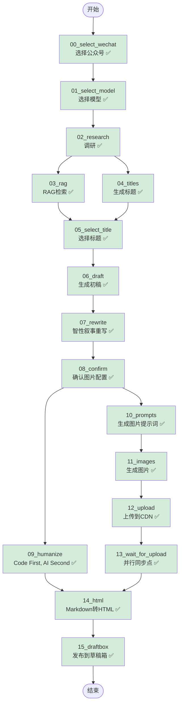

# Article Agent Workflow Graph

## 双重并行优化版流程图



**验证状态图例**:
- ✅ 已验证通过

## 验证进度表

| 节点 | 节点作用 | 类型 | 状态 |
|------|----------|------|------|
| 00_select_wechat | 选择公众号账号 | 交互 | ✅ 验证通过 |
| 01_select_model | 选择 LLM 模型 | 交互 | ✅ 验证通过 |
| 02_research | 搜索 + Brief 生成 | LLM | ✅ 验证通过 |
| 03_rag | RAG 向量检索 | LLM | ✅ 验证通过 |
| 04_titles | 生成 5-10 个候选标题 | LLM | ✅ 验证通过 |
| 05_select_title | 从候选标题中选择/自定义/重新生成 | 交互 | ✅ 验证通过 |
| 06_draft | Research + RAG → 初稿 | LLM | ✅ 验证通过 |
| 07_rewrite | 智性叙事重写 (IPS+HKR) | LLM | ✅ 验证通过 |
| 08_confirm | 确认图片数量和风格 | 交互 | ✅ 验证通过 |
| 09_humanize | Code 清洗 + LLM 风格优化 | LLM + Code | ✅ 验证通过 |
| 10_prompts | 生成图片提示词 (5种风格) | LLM | ✅ 验证通过 |
| 11_images | Ark API 生成图片（并行） | API | ✅ 验证通过 |
| 12_upload | 上传到微信 CDN（并行+回退） | API | ✅ 验证通过 |
| 13_wait_for_upload | 并行同步点 | 同步 | ✅ 验证通过 |
| 14_html | Markdown → HTML（替换图片） | Code | ✅ 验证通过 |
| 15_draftbox | 发布到微信草稿箱（stable token） | API | ✅ 验证通过 |

**当前进度**: 16/16 节点已验证 (100%)

## 数据流详解

### 阶段 1: 顺序前置流程
```
START → 00 → 01 → 02
```
- 选择公众号
- 选择模型
- 执行调研

### 阶段 2: 第一层并行 (Research 后)
```
        ┌─→ 03_rag ─────┐
02 ─────┤               ├─→ 05_select_title
        └─→ 04_titles ──┘
```

**关键设计**:
1. `03_rag` 和 `04_titles` 同时从 `02_research` 开始
2. 两者都完成后，`05_select_title` 才能执行（join 边）
3. **时间节省**: max(T03, T04) vs T03 + T04

### 阶段 3: 顺序中间流程
```
05 → 06 → 07 → 08
```
- 选择标题 → 生成初稿 → 智性叙事重写 → 确认图片配置

### 阶段 4: 第二层并行 (Confirm 后)
```
              ┌─→ 10_prompts → 11_images → 12_upload → 13_wait
08_confirm ───┤
              └─→ 09_humanize
```

**关键设计**:
1. `09_humanize` 和 `10_prompts` 同时从 `08_confirm` 开始
2. `10_prompts` 使用 `draft` 作为输入（不是 `humanized`）
3. `13_wait_for_upload` 确保上传完成后才触发 HTML 转换

### 阶段 5: 汇聚点
```
    ┌─ 09_humanize ──┐
───┤                 ├─→ 14_html → 15_draftbox → END
    └─ 13_wait ─────┘
```

**汇聚条件**:
- `09_humanize` 和 `13_wait_for_upload` 都完成后
- `14_html` 才开始执行（join 边）
- 将图片占位符替换为 CDN URL

## 性能优化分析

### 原串行流程
```
00 → 01 → 02 → 03 → 04 → 05 → 06 → 07 → 08 → 09 → 10 → 11 → 12 → 13 → 14 → 15
```

### 新并行流程（双重优化）
```
        ┌─ 03 ─────┐
02 ─────┤          ├─→ 05 → 06 → 07 → 08 ─┬─→ 09 ─────────────┐
        └─ 04 ─────┘                    └─→ 10 → 11 → 12 → 13 ┘
                                                    │
                                                    └──→ 14 ─→ 15
```

**第一层时间节省** (Research 后):
- 原: T03 + T04
- 新: max(T03, T04)
- 节省: min(T03, T04)

**第二层时间节省** (Confirm 后):
- 原: T09 + T10 + T11 + T12 + T13
- 新: max(T09, T10 + T11 + T12 + T13)
- 节省: min(T09, T10 + T11 + T12 + T13)

**总时间节省**:
```
原: T00 + T01 + T02 + T03 + ... + T15
新: T00 + T01 + T02 + max(T03, T04) + ... + max(T09, T10+T11+T12+T13) + T14 + T15
```

假设 T03=30s, T04=20s, T09=15s, T10+T11+T12+T13=30s:
- 第一层节省: 20s
- 第二层节省: 15s
- **总节省: 35s**

## 状态依赖关系

| 节点 | 读取状态 | 写入状态 |
|------|---------|---------|
| 08_confirm | - | `decisions.images.count` |
| 09_humanize | `decisions.images.count` | `humanized` + 占位符 |
| 10_prompts | `draft` + `decisions.images` | `imagePrompts` |
| 11_images | `imagePrompts` | `imagePaths` |
| 12_upload | `imagePaths` + `decisions.wechat` | `uploadedImageUrls` |
| 13_wait_for_upload | `uploadedImageUrls` | - |
| 14_html | `humanized` + `uploadedImageUrls` | `html` |

## 边界情况处理

### 如果 confirm 被跳过
- `09_humanize` 使用默认值 `imageCount = 0`
- `10_prompts` 使用默认值 `count = 4, style = infographic`

### 如果图片生成失败
- `12_upload` 返回空数组
- `14_html` 会报错并中止，需要重试上传或将图片数设为 0

### 如果 humanize 失败
- 降级到 `rewritten`
- `14_html` 继续执行

### 如果恢复会话时 wechat 配置缺失
- `12_upload` 触发回退机制，自动提示用户选择公众号
- 选择的配置自动保存到 state，下次恢复不会丢失
- 用户无需重新运行整个流程

## Humanize 节点数据流

```
rewritten (输入)
    ↓
[LLM] 去除 AI 味，增加活人感
    ↓
humanized (LLM 输出)
    ↓
[Code] cleanTextFormatting
    ├─ 破折号替换
    ├─ 标点中文化
    ├─ 去多余空格
    ├─ 去引号
    └─ 去空行
    ↓
[Code] restoreBoldMarkers (恢复加粗)
    ↓
[Code] ensureImagePlaceholders (插入图片占位符)
    ↓
humanized (最终输出)
```

## Upload 节点回退流程

```
state.decisions.wechat 存在？
    ↓ 是
正常上传
    ↓ 否
┌───────────────────┐
│ promptForWechat() │ ← 交互式选择公众号
└───────────────────┘
    ↓
保存到 state.decisions.wechat
    ↓
继续上传
```

## 并行执行检测机制

### Step CLI 并行追踪

```typescript
// 检测并行执行
if (eventType === "on_chain_start") {
    tracker.activeNodes.set(nodeName, Date.now());
    if (tracker.activeNodes.size > 1) {
        console.log(`⚡ 并行执行 [${tracker.activeNodes.size}]`);
    }
}
```

### 流式输出缓冲

**聚焦节点机制：**
- Research 后并行：聚焦 `04_titles`，缓冲 `02_rag`
- Confirm 后并行：聚焦 `09_humanize`，缓冲 `10_prompts/11_images/12_upload`

```typescript
const getStreamFocusNode = (currentNode: string): string | null => {
  if (currentNode === "04_titles" || currentNode === "03_rag") {
    return "04_titles";
  }
  if (currentNode === "09_humanize" ||
      currentNode === "10_prompts" ||
      currentNode === "11_images" ||
      currentNode === "12_upload" ||
      currentNode === "13_wait_for_upload") {
    return "09_humanize";
  }
  return null;
};
```

## 节点错误处理

### 错误恢复选项

当节点执行失败时，用户可以选择：

1. **重试 (r)**: 重新执行当前节点
2. **跳过 (s)**: 跳过当前节点，继续执行
3. **重新运行 (n)**: 从任意节点重新运行
4. **退出 (q)**: 退出流程，保存当前状态

### 错误处理流程

```typescript
async function handleNodeError(error, threadId, ...) {
  console.error("错误:", error);

  const answer = await inquirer.prompt([
    {
      type: "list",
      name: "action",
      message: "选择操作 [r=重试, s=跳过, n=从某节点重新运行, q=退出]: "
    }
  ]);

  switch (answer.action) {
    case "r": await retry(); break;
    case "s": await skip(); break;
    case "n": await rerunFromNode(); break;
    case "q": await exit(); break;
  }
}
```

## 性能指标

### MetricsTracker 追踪

**节点执行统计：**
- 执行时间
- 成功/失败状态
- LLM Token 使用量

**系统资源：**
- 内存使用（heap/heap total/rss）
- 节点错误统计

**使用示例：**
```typescript
const startTime = metrics.startNodeExecution("09_humanize");
try {
  const result = await callLLM(...);
  metrics.endNodeExecution("09_humanize", startTime, true, undefined, {
    promptTokens: result.promptTokens,
    completionTokens: result.completionTokens,
    totalTokens: result.totalTokens
  });
} catch (error) {
  metrics.endNodeExecution("09_humanize", startTime, false, String(error));
}
```

## ResumeManager 功能

### Thread 列表显示

```
⭐ [推荐] ✅ 今晚 20点30分 - 写一篇关于 AI Agent 的文章
   节点: 草稿箱 | 已耗时: 5m 30s
  ✅ 昨天 14点20分 - 另一个主题
   节点: 完成 | 已耗时: 4m 15s
  ⏸️ 前天 10点10分 - 中断的主题
   节点: 生成图片 | 已耗时: 2m 40s
────────────────────────────────────────────────────────
🆕 新建会话
```

### Checkpoint 列表显示

```
⭐ [推荐] 20点30分 - 生成图片提示词
   候选数: 5 个
   ↓ 下一步: 生成图片
  20点25分 - 确认图片配置
  20点15分 - 智性叙事重写
────────────────────────────────────────────────────────
🔙 返回
```

## 完整使用示例

### 新建文章

```bash
npm run step
```

**流程：**
1. 选择公众号
2. 选择模型
3. 输入主题
4. 等待调研 + RAG + 标题生成（并行）
5. 选择标题
6. 等待初稿 + 重写
7. 确认图片配置
8. 等待人化 + 图片生成 + 上传（并行）
9. HTML 转换 + 发布到草稿箱

### 恢复中断的会话

```bash
npm run step -- --resume
```

**流程：**
1. 选择要恢复的会话
2. 选择恢复点（checkpoint）
3. 从中断处继续执行

### 从特定节点重新运行

```bash
npm run step -- --resume
# 在错误处理菜单选择 'n' (从某节点重新运行)
# 选择要重新运行的节点
```

## 下一步优化

### 已完成 ✅
- 双重并行优化
- Humanize 重构（Code First, AI Second）
- Upload 回退机制
- ResumeManager 增强
- Step CLI 流式输出缓冲
- MetricsTracker 完整实现

### 计划中 📋
- 工作流端到端测试
- 基于实际使用的 Prompt 优化
- 错误处理增强
- 更多风格的图片提示词模板
- 性能监控面板
- 导出格式扩展（PDF、DOCX）
