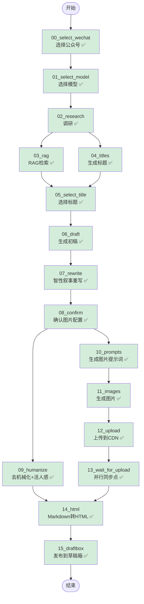

# Article Agent Workflow Graph

## 双重并行优化版流程图



**验证状态图例**:
- ✅ 已验证通过
- 🔧 修复中
- ⏸️ 待验证

## 验证进度表

| 节点 | 节点作用 | 类型 | 状态 |
|------|----------|------|------|
| 00_select_wechat | 选择公众号账号 | 交互 | ✅ 验证通过 |
| 01_select_model | 选择 LLM 模型 | 交互 | ✅ 验证通过 |
| 02_research | 搜索 + Brief 生成 | LLM | ✅ 验证通过 |
| 03_rag | RAG 向量检索 | LLM | ✅ 验证通过 |
| 04_titles | 生成 8 个候选标题 | LLM | ✅ 验证通过 |
| 05_select_title | 从候选标题中选择 | 交互 | ✅ 验证通过 |
| 06_draft | Research + RAG → 初稿 | LLM | ✅ 验证通过 |
| 07_rewrite | 智性叙事重写 (IPS+HKR) | LLM | ✅ 验证通过 |
| 08_confirm | 确认图片数量和风格 | 交互 | ✅ 验证通过 |
| 09_humanize | 去 AI 味 + 活人感 | LLM | ✅ 验证通过 |
| 10_prompts | 生成图片提示词 (5种风格) | LLM | ✅ 验证通过 |
| 11_images | Ark API 生成图片 | API | ✅ 验证通过 |
| 12_upload | 上传到微信 CDN | API | ✅ 验证通过 |
| 13_wait_for_upload | 并行同步点 | 同步 | ✅ 验证通过 |
| 14_html | Markdown → HTML | 代码 | ✅ 验证通过 |
| 15_draftbox | 发布到微信草稿箱 | API | ✅ 验证通过 |

**当前进度**: 16/16 节点已验证 (100%)

## 数据流详解

### 阶段 1: 顺序前置流程
```
START → 00 → 01 → 02
```
- 选择公众号
- 选择模型
- 执行调研

### 阶段 2: 第一层并行 (Research 后)
```
        ┌─→ 03_rag ─────┐
02 ─────┤               ├─→ 05_select_title
        └─→ 04_titles ──┘
```

**关键设计**:
1. `03_rag` 和 `04_titles` 同时从 `02_research` 开始
2. 两者都完成后，`05_select_title` 才能执行
3. **时间节省**: max(T03, T04) vs T03 + T04

### 阶段 3: 顺序中间流程
```
05 → 06 → 07 → 08
```
- 选择标题 → 生成初稿 → 智性叙事重写 → 确认图片配置

### 阶段 4: 第二层并行 (Confirm 后)
```
              ┌─→ 10_prompts → 11_images → 12_upload → 13_wait
08_confirm ───┤
              └─→ 09_humanize
```

**关键设计**:
1. `09_humanize` 和 `10_prompts` 同时从 `08_confirm` 开始
2. `10_prompts` 使用 `draft` 作为输入（不是 `humanized`）
3. `13_wait_for_upload` 确保图片上传完成后才触发 HTML 转换

### 阶段 5: 汇聚点
```
    ┌─ 09_humanize ──┐
───┤                 ├─→ 14_html → 15_draftbox → END
    └─ 13_wait ─────┘
```

**汇聚条件**:
- `09_humanize` 和 `13_wait_for_upload` 都完成后
- `14_html` 才开始执行
- 将图片占位符替换为 CDN URL

## 性能优化分析

### 原串行流程
```
00 → 01 → 02 → 03 → 04 → 05 → 06 → 07 → 08 → 09 → 10 → 11 → 12 → 13 → 14 → 15
```

### 新并行流程（双重优化）
```
        ┌─ 03 ─────┐
02 ─────┤          ├─→ 05 → 06 → 07 → 08 ─┬─→ 09 ─────────────┐
        └─ 04 ─────┘                    └─→ 10 → 11 → 12 → 13 ┘
                                                    │
                                                    └──→ 14 ─→ 15
```

**第一层时间节省** (Research 后):
- 原: T03 + T04
- 新: max(T03, T04)
- 节省: min(T03, T04)

**第二层时间节省** (Confirm 后):
- 原: T09 + T10 + T11 + T12 + T13
- 新: max(T09, T10 + T11 + T12 + T13)
- 节省: min(T09, T10 + T11 + T12 + T13)

**总时间节省**:
```
原: T00 + T01 + T02 + T03 + ... + T15
新: T00 + T01 + T02 + max(T03, T04) + ... + max(T09, T10+T11+T12+T13) + T14 + T15
```

假设 T03=30s, T04=20s, T09=15s, T10+T11+T12+T13=30s:
- 第一层节省: 20s
- 第二层节省: 15s
- **总节省: 35s**

## 状态依赖关系

| 节点 | 读取状态 | 写入状态 |
|------|---------|---------|
| 08_confirm | - | `decisions.images.count` |
| 09_humanize | `decisions.images.count` | `humanized` + 占位符 |
| 10_prompts | `draft` + `decisions.images` | `imagePrompts` |
| 11_images | `imagePrompts` | `imagePaths` |
| 12_upload | `imagePaths` | `uploadedImageUrls` |
| 13_wait_for_upload | `uploadedImageUrls` | - |
| 14_html | `humanized` + `uploadedImageUrls` | `html` |

## 边界情况处理

### 如果 confirm 被跳过
- `09_humanize` 使用默认值 `imageCount = 0`
- `10_prompts` 使用默认值 `count = 4, style = infographic`

### 如果图片生成失败
- `12_upload` 返回空数组
- `14_html` 会报错并中止，需要重试上传或将图片数设为 0

### 如果 humanize 失败
- 降级到 `rewritten`
- `14_html` 继续执行

### 如果恢复会话时 wechat 配置缺失
- `12_upload` 触发回退机制，自动提示用户选择公众号
- 选择的配置自动保存到 state，下次恢复不会丢失
- 用户无需重新运行整个流程
