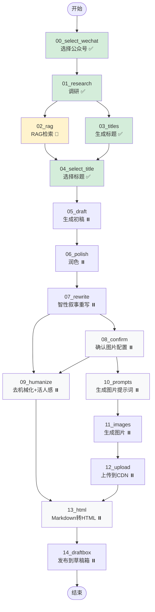

# Article Agent Workflow Graph

## 双重并行优化版流程图



**验证状态图例**:
- ✅ 已验证通过
- 🔧 修复中
- ⏸️ 待验证

## 验证进度表

| 节点 | 节点作用 | 类型 | 状态 |
|------|----------|------|------|
| 00_select_wechat | 选择公众号账号 | 交互 | ✅ 验证通过 |
| 01_research | 搜索 + Brief 生成 | LLM | ✅ 验证通过 |
| 02_rag | RAG 向量检索 | LLM | 🔧 修复中 |
| 03_titles | 生成 8 个候选标题 | LLM | ✅ 验证通过 |
| 04_select_title | 从候选标题中选择 | 交互 | ✅ 验证通过 |
| 05_draft | Research + RAG → 初稿 | LLM | ⏸️ 待验证 |
| 06_polish | 语言润色优化 | LLM | ⏸️ 待验证 |
| 07_rewrite | 智性叙事重写 (IPS+HKR) | LLM | ⏸️ 待验证 |
| 08_confirm | 确认图片数量和风格 | 交互 | ⏸️ 待验证 |
| 09_humanize | 去 AI 味 + 活人感 | LLM | ⏸️ 待验证 |
| 10_prompts | 生成图片提示词 (5种风格) | LLM | ⏸️ 待验证 |
| 11_images | Ark API 生成图片 | API | ⏸️ 待验证 |
| 12_upload | 上传到微信 CDN | API | ⏸️ 待验证 |
| 13_html | Markdown → HTML | 代码 | ⏸️ 待验证 |
| 14_draftbox | 发布到微信草稿箱 | API | ⏸️ 待验证 |

**当前进度**: 4/15 节点已验证 (27%)

## 数据流详解

### 阶段 1: 顺序前置流程
```
START → 00 → 01
```
- 选择公众号
- 执行调研

### 阶段 2: 第一层并行 (Research 后)
```
        ┌─→ 02_rag ─────┐
01 ─────┤               ├─→ 04_select_title
        └─→ 03_titles ──┘
```

**关键设计**:
1. `02_rag` 和 `03_titles` 同时从 `01_research` 开始
2. 两者都完成后，`04_select_title` 才能执行
3. **时间节省**: max(T02, T03) vs T02 + T03

### 阶段 3: 顺序中间流程
```
04 → 05 → 06 → 07
```
- 选择标题 → 生成初稿 → 润色 → 智性叙事重写

### 阶段 4: 第二层并行 (Rewrite 后)
```
              ┌─→ 08_confirm ─┬─→ 10_prompts → 11 → 12
07_rewrite ───┤               │
              └─→ 09_humanize ←┘
```

**关键设计**:
1. `08_confirm` 和 `09_humanize` 同时从 `07_rewrite` 开始
2. `09_humanize` 等待 `08_confirm` 完成（获取 imageCount）
3. `10_prompts` 在 `08_confirm` 完成后执行
4. `10_prompts` 使用 `draft` 作为输入（不是 `humanized`）

### 阶段 5: 汇聚点
```
    ┌─ 09_humanize ─┐
───┤                ├─→ 13_html → 14 → END
    └─ 12_upload ───┘
```

**汇聚条件**:
- `09_humanize` 和 `12_upload` 都完成后
- `13_html` 才开始执行
- 将图片占位符替换为 CDN URL

## 性能优化分析

### 原串行流程
```
01 → 02 → 03 → 04 → 05 → 06 → 07 → 08 → 09 → 10 → 11 → 12 → 13
```

### 新并行流程（双重优化）
```
        ┌─ 02 ─────┐
01 ─────┤          ├─→ 04 → 05 → 06 → 07 ─┬─→ 08 ─┬─→ 10 → 11 → 12 ─┬─→ 13
        └─ 03 ─────┘                    └─→ 09 ←┘                  │
                                        └─────────────────────────┘
```

**第一层时间节省** (Research 后):
- 原: T02 + T03
- 新: max(T02, T03)
- 节省: min(T02, T03)

**第二层时间节省** (Rewrite 后):
- 原: T08 + T09 + T10 + T11 + T12
- 新: max(T08 + T10 + T11 + T12, T09)
- 节省: T09 (humanize 节点执行时间)

**总时间节省**:
```
原: T01 + T02 + T03 + ... + T13
新: T01 + max(T02, T03) + ... + max(T08+T10+T11+T12, T09) + T13
```

假设 T02=30s, T03=20s, T09=15s:
- 第一层节省: 20s
- 第二层节省: 15s
- **总节省: 35s**

## 状态依赖关系

| 节点 | 读取状态 | 写入状态 |
|------|---------|---------|
| 08_confirm | - | `decisions.images.count` |
| 09_humanize | `decisions.images.count` | `humanized` + 占位符 |
| 10_prompts | `draft` + `decisions.images` | `imagePrompts` |
| 11_images | `imagePrompts` | `imagePaths` |
| 12_upload | `imagePaths` | `uploadedImageUrls` |
| 13_html | `humanized` + `uploadedImageUrls` | `html` |

## 边界情况处理

### 如果 confirm 被跳过
- `09_humanize` 使用默认值 `imageCount = 0`
- `10_prompts` 使用默认值 `count = 4, style = infographic`

### 如果图片生成失败
- `12_upload` 返回空数组
- `13_html` 跳过图片替换，保留占位符

### 如果 humanize 失败
- 降级到 `rewritten` 或 `polished`
- `13_html` 继续执行
